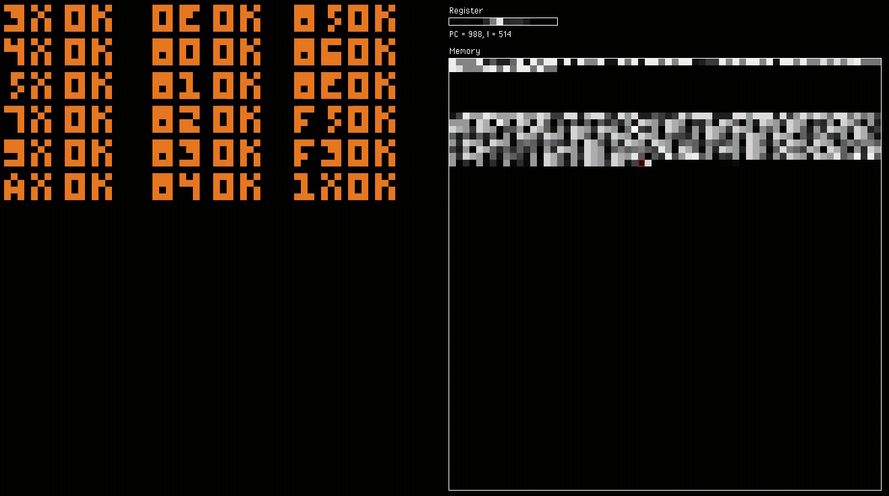

# VisChip8

A Visual Chip-8 emulator.

* Pass [test rom](https://github.com/corax89/chip8-test-rom)
* Visual Display for current machine states: registers, memory, program counter(`pc`), and `I`.
* **Cross-platform**: Written in [Haxe](https://haxe.org), can be compile to js to run inside browser or to [hashlink](https://hashlink.haxe.org/) to run on local machine.

## About Chip-8

> CHIP-8 is an interpreted programming language, developed by Joseph Weisbecker. It was initially used on the COSMAC VIP and Telmac 1800 8-bit microcomputers in the mid-1970s. CHIP-8 programs are run on a CHIP-8 virtual machine. It was made to allow video games to be more easily programmed for these computers.
> Roughly fifteen years after CHIP-8 was introduced, derived interpreters appeared for some models of graphing calculators (from the late 1980s onward, these handheld devices in many ways have more computing power than most mid-1970s microcomputers for hobbyists).
> -- wikipedia

## Todo

- [ ] Keyboard input
- [ ] Sound
- [ ] Rom loader

## License

The MIT License

## References

* https://en.wikipedia.org/wiki/CHIP-8
* https://tobiasvl.github.io/blog/write-a-chip-8-emulator/
* https://github.com/corax89/chip8-test-rom
* https://github.com/JamesGriffin/CHIP-8-Emulator/blob/master/src/chip8.cpp
* http://www.multigesture.net/articles/how-to-write-an-emulator-chip-8-interpreter/